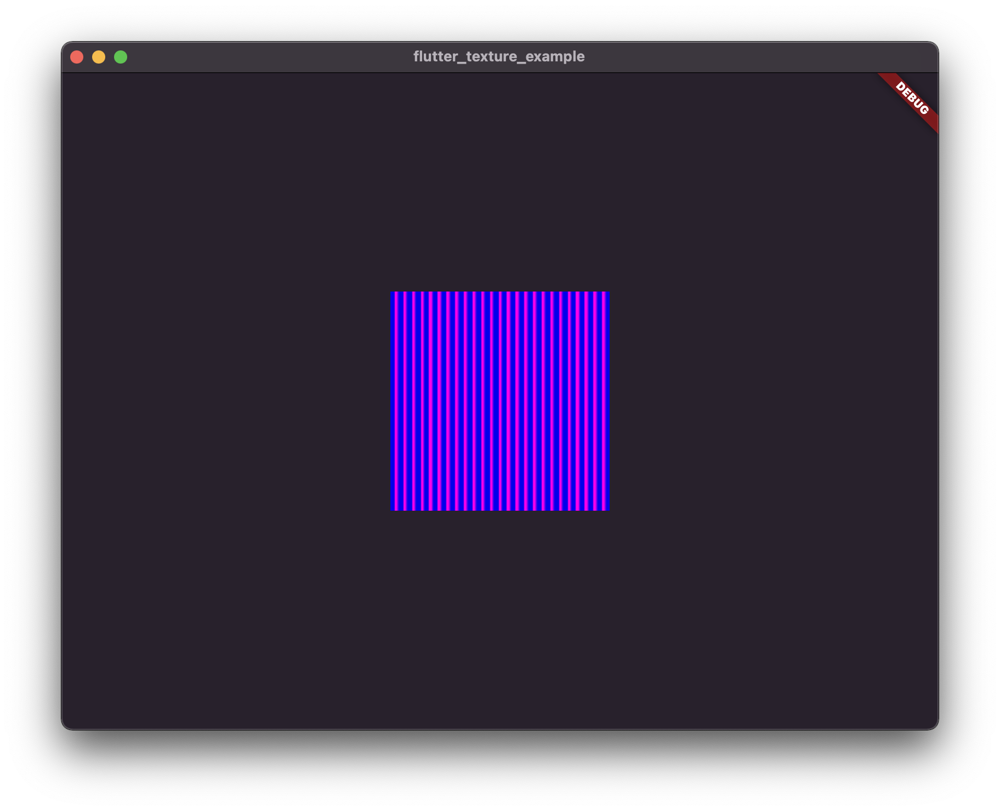

# flutter_texture_example

Demo metal texture rendering within flutter app.

Some parts were based on https://github.com/mogol/opengl_texture_widget_example

## CPU Usage
Rendering `Texture(textureId: id)` linked to the display's frame-rate causes
CPU usage to hover at around 16% on my computer to tick the render loop.

For reference, an empty view app uses 2% CPU idle.

Most of the time is spent in Flutter's internal rendering code.

Wrapping its tree on a `RepaintBoundary` seems to improve this by 2-4%.

One improvement would be to stop the render loop when an app goes into the
background.

Rendering 5 textures at the same time pushes CPU up to around 30%. It might be
possible to say each texture after the first is causing a ~4% CPU usage
increase.

I'd imagine some CPU usage is caused by the Swift render loop I wrote & could be
optimised a bit more.